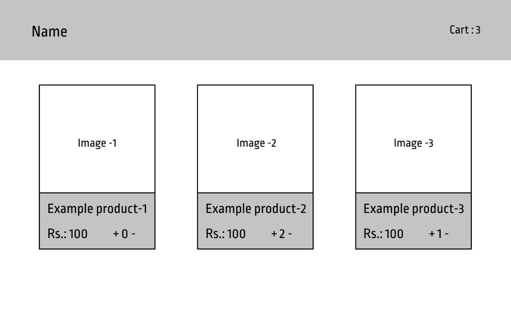

# E-commerce page to view products

1. Given an `array` of objects similar to:

```json
[
  {
    "id": 1,
    "name": "Example Name 1",
    "description": "Example description 1",
    "price": 998,
    "imageUrl": "https://picsum.photos/seed/picsum/300/200",
    "cartCount": 0
  },
  {
    "id": 2,
    "name": "Example Name 2",
    "description": "Example description 2",
    "price": 938,
    "imageUrl": "https://picsum.photos/seed/picsum/300/200",
    "cartCount": 3
  }
]
```

2. Display each product in the `Array`.

3. Each product should have an option to `Add` or `Remove` it from the cart.

4. Somewhere on the page the total `number` of products in the `cart` should be displayed.

5. The general mock up of the UI screen is attached below:


